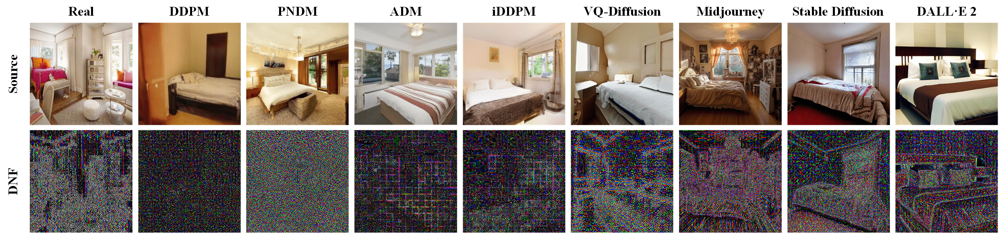

# Diffusion-Noise-Feature-Accurate-and-Fast-Generated-Image-Detection

[Yichi Zhang](https://yichics.github.io/) and [Xiaogang Xu](https://xiaogang00.github.io/)

Code repository for the paper: [Diffusion Noise Feature: Accurate and Fast Generated Image Detection](https://arxiv.org/abs/2312.02625). The code is based on [DDIM](https://github.com/ermongroup/ddim)




## Preparation

**Model Preparation**

download the pretrained DDIM from [here](https://heibox.uni-heidelberg.de/f/f179d4f21ebc4d43bbfe/?dl=1). Place it in `./weights/diffusion/` .

**Dataset Preparation**

Download the DiffusionForensics Dataset from  [[OneDrive](https://mailustceducn-my.sharepoint.com/:f:/g/personal/zhendongwang_mail_ustc_edu_cn/EtKXrn4cjWtBi0H3v4j1ICsBKraCxnZiTWU4VzqRr0ilCw?e=trkgDR)]/[[RecDrive (code: dire)](https://rec.ustc.edu.cn/share/ec980150-4615-11ee-be0a-eb822f25e070)]

You are supposed to place the extracted files in the following structure in folder `./dataset/`.
```
dataset
└──source/dnf
    └── train/val/test
        ├── lsun_bedroom
        │   ├── real
        │   │   └──img1.png...
        │   ├── adm
        │   │   └──img1.png...
        │   ├── ...
        ├── imagenet
        │   ├── real
        │   │   └──img1.png...
        │   ├── adm
        │   │   └──img1.png...
        │   ├── ...
        └── celebahq
            ├── real
            │   └──img1.png...
            ├── adm
            │   └──img1.png...
            ├── ...

```

## Transform the image to DNF
```
python main.py --i2n
```
You should pay attention to separately processing the data in the `train` and `val` sets to ensure the correct functioning of the training. Modify the parameters in `./config/demo.yml` to achieve this.

## Training
```
python main.py --train
```

## Test
```
python main.py --test
```
Please select the model you wish to test. Modify the parameters in `./config/demo.yml` to achieve this.

*Some Bugs may exits*
