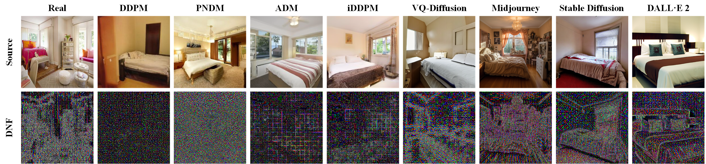

# Diffusion-Noise-Feature-Accurate-and-Fast-Generated-Image-Detection

[Yichi Zhang](https://yichics.github.io/) and [Xiaogang Xu](https://xiaogang00.github.io/)

Code repository for the paper: [Diffusion Noise Feature: Accurate and Fast Generated Image Detection](https://arxiv.org/abs/2312.02625). 



### Baseline

The code is based on [CNNDetction](https://github.com/PeterWang512/CNNDetection)

**Model Preparation**

Download the LSUN Bedroom pretrained DDIM from [here](https://heibox.uni-heidelberg.de/f/f179d4f21ebc4d43bbfe/?dl=1). Place it in `./weights/diffusion/` .

We will release the checkpoints in the following updates.

**Dataset Preparation**

Download the **DiffusionForensics** from  [[OneDrive](https://mailustceducn-my.sharepoint.com/:f:/g/personal/zhendongwang_mail_ustc_edu_cn/EtKXrn4cjWtBi0H3v4j1ICsBKraCxnZiTWU4VzqRr0ilCw?e=trkgDR)]/[[RecDrive (code: dire)](https://rec.ustc.edu.cn/share/ec980150-4615-11ee-be0a-eb822f25e070)]

<!-- Downlaod the **CNNSpot** from [CNNDetction](https://github.com/PeterWang512/CNNDetection) -->

Please refer to [CNNDetction](https://github.com/PeterWang512/CNNDetection) for the storage path of the dataset.

**Transform Image to DNF**

```
python compute_dnf.py
```

**Training**

```
python train.py 
```
**Evaluation**

```
python eval.py 
```


Please refer to `./options` for variables that determine the program’s execution.


### Citation 

```
@article{zhang2023diffusion,
  title={Diffusion noise feature: Accurate and fast generated image detection},
  author={Zhang, Yichi and Xu, Xiaogang},
  journal={arXiv preprint arXiv:2312.02625},
  year={2023}
}
```